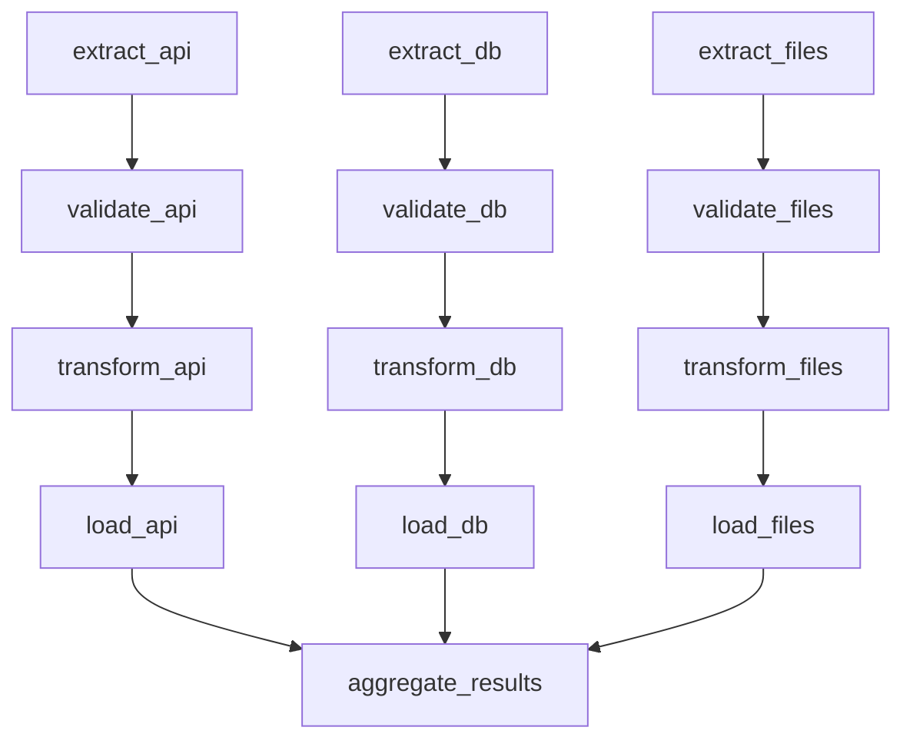

# ETL Pipeline DAG

## Pipeline Overview
- **Extract**: Parallel data extraction from multiple sources
- **Validate**: Data quality checks
- **Transform**: Data processing and enrichment
- **Load**: Data warehouse loading
- **Aggregate**: Final results aggregation
